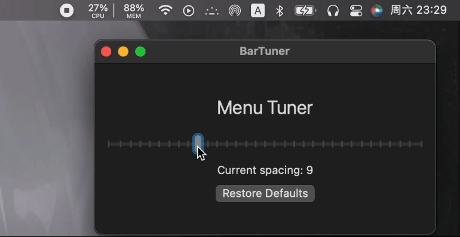

# BarTuner


**BarTuner** 是一款专为 macOS 用户设计的工具，旨在帮助调节菜单栏右上角图标的间距，提升用户界面体验。



## 背景

随着 **MacBook 14** 及以后版本的发布，苹果引入了新的 **刘海设计**，这使得屏幕中央的显示区域变得更加紧凑。与此同时，右侧状态栏的图标间距相较于以前的设计有所增宽，导致原本就空间有限的菜单栏显得更加拥挤，影响了工作效率和视觉舒适度。

## 主要功能

BarTuner 可以轻松调整 macOS 菜单栏右上角图标的间距，使得用户能够根据自己的需求优化菜单栏布局。无论是减少图标间距，还是根据个人喜好进行定制，BarTuner 都能帮助你恢复清爽、整洁的菜单栏外观。

### 功能亮点：
- **灵活调整**：支持自定义菜单栏图标的间距。
- **直观操作**：通过简单易用的界面进行调整，无需复杂配置。
- **提升效率**：优化菜单栏布局，避免过于拥挤，提升视觉体验和操作效率。

### 使用：

1. [前往Releases下载](https://github.com/s1xu/BarTuner/releases)
2. 打开dmg, 会在桌面生成BarTuner
3. 点击打开BarTuner，将BarTuner拖入右侧文件夹
4. 如无法打开、文件已损坏或其他提示，需移除隔离属性

| 在终端输入：
```
sudo xattr -dr com.apple.quarantine /Applications/BarTuner.app
```

### 许可证
此项目采用 MIT 许可证。
